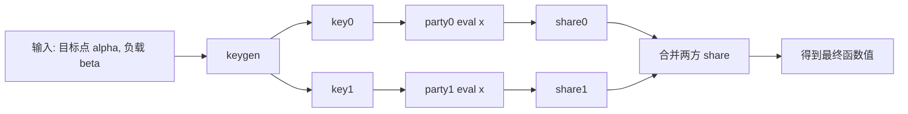
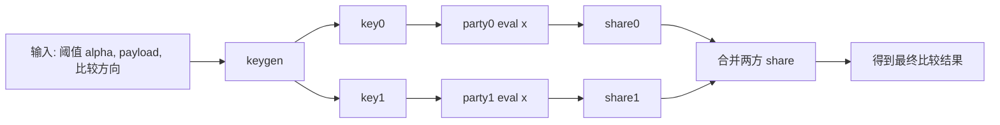
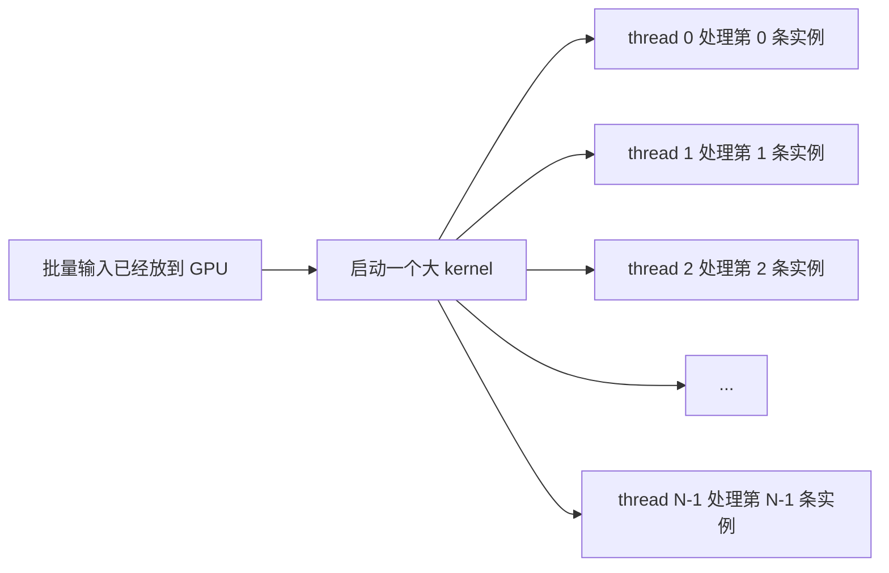
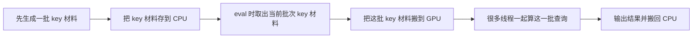

# benchmark 技术细节

这版文档先讲两件事：

1. `DPF / DCF` 本身的工作流程是什么
2. `myl7/fss` 和 `Orca/FSS` 各自是怎么把它并行化的

最后再回到 benchmark，说明每个时间字段到底量的是哪一段流程。

## 1. DPF 的工作流程

可以把 `DPF` 先理解成：

- 目标是表示一个“点函数”
- 这个点函数只在某个目标位置 `alpha` 上非零
- `keygen` 把这个函数拆成两份 key
- 两方各自拿自己的 key 去对查询 `x` 求值
- 两方结果相加，恢复目标函数值

### DPF 的抽象流程



如果只看“大流程”，DPF 就是两段：

- `keygen`
  - 根据 `alpha / beta` 生成两份 key
- `eval`
  - 每方拿自己的 key 和查询点 `x`，算出一个 share

## 2. DCF 的工作流程

可以把 `DCF` 理解成：

- 目标是表示一个“比较函数”
- 不是判断 `x == alpha`
- 而是判断 `x < alpha` 或 `x <= alpha`
- 其余流程和 DPF 一样，也是先 keygen，再两方各自 eval，最后合并 share

### DCF 的抽象流程



## 3. DPF 和 DCF 的共同结构

从实现角度看，这两个 primitive 的共同点是：

- 都是“先生成两方 key，再分别求值”
- 都天然适合做批量并行
- 因为一批不同的 `alpha` 或 `x` 之间基本彼此独立

所以真正的工程问题通常不是“能不能并行”，而是：

- 并行的基本单位是什么
- 是“一线程处理一个实例”，还是“把 key 拆成多块做批处理”
- host / device 之间搬多少数据
- benchmark 到底量的是纯 kernel，还是整段 runtime 调用

## 4. `myl7/fss` 的并行实现思路

入口文件：

- [fss/src/bench_gpu.cu](/home/yy404nf/FSS-Work/fss/src/bench_gpu.cu)

### 4.1 这套实现的核心思路

这套实现的思路非常直接：

- 把一大批彼此独立的 DPF/DCF 实例放到 GPU 上
- 一个 CUDA thread 负责一条实例
- 这个 thread 在自己内部把这一条实例的 `Gen` 或 `Eval` 完整跑完

从代码能直接看到这一点：

- DPF gen kernel 里每个 `tid` 取自己那一份 `seeds / alpha / beta`
- 然后直接做一次 `dpf.Gen(...)`
- DPF eval kernel 里每个 `tid` 取自己那一份 `seed / cws / x`
- 然后直接做一次 `dpf.Eval(...)`

对应代码：

- [fss/src/bench_gpu.cu](/home/yy404nf/FSS-Work/fss/src/bench_gpu.cu):49
- [fss/src/bench_gpu.cu](/home/yy404nf/FSS-Work/fss/src/bench_gpu.cu):58
- [fss/src/bench_gpu.cu](/home/yy404nf/FSS-Work/fss/src/bench_gpu.cu):59
- [fss/src/bench_gpu.cu](/home/yy404nf/FSS-Work/fss/src/bench_gpu.cu):62
- [fss/src/bench_gpu.cu](/home/yy404nf/FSS-Work/fss/src/bench_gpu.cu):71
- [fss/src/bench_gpu.cu](/home/yy404nf/FSS-Work/fss/src/bench_gpu.cu):121
- [fss/src/bench_gpu.cu](/home/yy404nf/FSS-Work/fss/src/bench_gpu.cu):131
- [fss/src/bench_gpu.cu](/home/yy404nf/FSS-Work/fss/src/bench_gpu.cu):135
- [fss/src/bench_gpu.cu](/home/yy404nf/FSS-Work/fss/src/bench_gpu.cu):143

### 4.2 这套并行化长什么样



每个 thread 负责的事情是“完整的一条实例”，而不是“树的一层”或者“key 的一部分”。

所以这套实现更像：

- `instance-level data parallelism`

也就是：

- 并行单位是“实例”
- 一条实例内部的逻辑主要留在单线程里做

### 4.3 DPF 在这套实现里的流程


### 4.4 DCF 在这套实现里的流程


### 4.5 这套实现的 benchmark 为什么会很“像纯 kernel”

因为 benchmark 代码本身就是这样写的：

- 先把输入准备好
- 先把 GPU 内存分配好
- 如果是 eval，还会先把 `cws` 预生成好
- 真正计时的时候，只包住一个 kernel

所以它更像在问：

- `DpfGenKernel` 本体有多快
- `DpfEvalKernel` 本体有多快
- `DcfGenKernel` 本体有多快
- `DcfEvalKernel` 本体有多快

## 5. `Orca/FSS` 的并行实现思路

相关入口文件：

- [FSS/fss/dpf_api.h](/home/yy404nf/FSS-Work/FSS/fss/dpf_api.h)
- [FSS/fss/dcf_api.h](/home/yy404nf/FSS-Work/FSS/fss/dcf_api.h)
- [FSS/fss/gpu_dpf.cu](/home/yy404nf/FSS-Work/FSS/fss/gpu_dpf.cu)
- [FSS/fss/gpu_dcf.cu](/home/yy404nf/FSS-Work/FSS/fss/gpu_dcf.cu)

### 5.1 这套实现的核心思路

你可以先把 `Orca/FSS` 理解成下面这句话：

- 它不是“一个 thread 从头到尾独立算完一个 DPF/DCF 实例”
- 它更像“先把做题要用的材料整理好，再把一批材料交给 GPU 上的很多线程一起算”

如果用很口语的话来说，`myl7/fss` 像这样：

- 我这里有很多题
- 每个线程各领一题
- 每个人自己把整题做完

而 `Orca/FSS` 更像这样：

- 先把题目拆成一套统一格式的材料
- 把这些材料先存好
- 真正做题时，再把当前这一批需要的材料拿出来
- 交给 GPU 上很多线程一起处理这一批数据

所以它和 `myl7/fss` 最大的区别不是“有没有并行”，而是：

- `myl7/fss` 的并行单位更像“完整实例”
- `Orca/FSS` 的并行单位更像“当前这一批数据 + 当前这批对应的 key 材料”

可以先看这个高层流程图：



这里你只需要先理解两个概念：

- `KeyBlob`
  - 可以先把它理解成“已经整理好、放在 CPU 内存里的一大包 key 材料”
- `tree key`
  - 可以先把它理解成“为了让 GPU 更好计算，把 key 拆成了几块数组材料”

也就是说，`Orca/FSS` 不是拿着一个“完整对象”直接丢给一个线程，而是：

1. 先把 key 变成适合存储和搬运的一包材料
2. eval 时再把这包材料里当前批次需要的部分搬到 GPU
3. 让很多线程一起算这一批输入

从代码上能看到这个大框架：

- DPF keygen 先把 `rin` 搬到 GPU，再调用 `gpuKeyGenDPF(...)`
- DPF eval 先把 `x` 搬到 GPU，再读取 key，再调用 `gpuDpf(...)`
- DCF 也是同样结构

对应：

- [FSS/fss/dpf_api.h](/home/yy404nf/FSS-Work/FSS/fss/dpf_api.h):17
- [FSS/fss/dpf_api.h](/home/yy404nf/FSS-Work/FSS/fss/dpf_api.h):26
- [FSS/fss/dpf_api.h](/home/yy404nf/FSS-Work/FSS/fss/dpf_api.h):30
- [FSS/fss/dpf_api.h](/home/yy404nf/FSS-Work/FSS/fss/dpf_api.h):44
- [FSS/fss/dpf_api.h](/home/yy404nf/FSS-Work/FSS/fss/dpf_api.h):49
- [FSS/fss/dpf_api.h](/home/yy404nf/FSS-Work/FSS/fss/dpf_api.h):51
- [FSS/fss/dpf_api.h](/home/yy404nf/FSS-Work/FSS/fss/dpf_api.h):52
- [FSS/fss/dcf_api.h](/home/yy404nf/FSS-Work/FSS/fss/dcf_api.h):17
- [FSS/fss/dcf_api.h](/home/yy404nf/FSS-Work/FSS/fss/dcf_api.h):26
- [FSS/fss/dcf_api.h](/home/yy404nf/FSS-Work/FSS/fss/dcf_api.h):30
- [FSS/fss/dcf_api.h](/home/yy404nf/FSS-Work/FSS/fss/dcf_api.h):44
- [FSS/fss/dcf_api.h](/home/yy404nf/FSS-Work/FSS/fss/dcf_api.h):49
- [FSS/fss/dcf_api.h](/home/yy404nf/FSS-Work/FSS/fss/dcf_api.h):51
- [FSS/fss/dcf_api.h](/home/yy404nf/FSS-Work/FSS/fss/dcf_api.h):52

### 5.2 它的并行单位不是“整个调用”，而是“批内 GPU 计算”

这套实现的思路更像：

- host 侧负责 orchestration
- GPU 侧负责批内并行计算
- 如果批太大，就切成多个 batch，逐批处理

可以直接从代码看到：

- keygen 会按内存预算把大任务切 batch
- eval 也会按 `k.B` 一批一批地 launch tree-eval kernel

对应：

- [FSS/runtime/standalone_runtime.h](/home/yy404nf/FSS-Work/FSS/runtime/standalone_runtime.h):22
- [FSS/runtime/standalone_runtime.h](/home/yy404nf/FSS-Work/FSS/runtime/standalone_runtime.h):31
- [FSS/runtime/standalone_runtime.h](/home/yy404nf/FSS-Work/FSS/runtime/standalone_runtime.h):39
- [FSS/fss/gpu_dpf.cu](/home/yy404nf/FSS-Work/FSS/fss/gpu_dpf.cu):408
- [FSS/fss/gpu_dpf.cu](/home/yy404nf/FSS-Work/FSS/fss/gpu_dpf.cu):414
- [FSS/fss/gpu_dpf.cu](/home/yy404nf/FSS-Work/FSS/fss/gpu_dpf.cu):419
- [FSS/fss/gpu_dpf.cu](/home/yy404nf/FSS-Work/FSS/fss/gpu_dpf.cu):246
- [FSS/fss/gpu_dcf.cu](/home/yy404nf/FSS-Work/FSS/fss/gpu_dcf.cu):158
- [FSS/fss/gpu_dcf.cu](/home/yy404nf/FSS-Work/FSS/fss/gpu_dcf.cu):333
- [FSS/fss/gpu_dcf.cu](/home/yy404nf/FSS-Work/FSS/fss/gpu_dcf.cu):349
- [FSS/fss/gpu_dcf.cu](/home/yy404nf/FSS-Work/FSS/fss/gpu_dcf.cu):355

### 5.3 DPF 在这套实现里的流程


这里真正“GPU 并行”的核心在两层：

- batch 内部，kernel 里并行处理很多元素
- 大输入规模时，整个问题被拆成多个 batch

### 5.4 DCF 在这套实现里的流程


### 5.5 这套实现为什么 benchmark 更像“整段调用”

因为 benchmark 包住的是 facade 接口：

- `generateDpfKeys(...)`
- `generateDcfKeys(...)`
- `evalDpf(...)`
- `evalDcf(...)`

所以它量进去的不只是 kernel，还包括：

- host -> device 搬运
- key 的序列化和反序列化
- batch 调度
- kernel 启动与同步
- packed 输出拷回 host
- CPU 解包

换句话说，它更像在问：

- “从上层看来，做完一次 DPF/DCF keygen 或 eval 到底要多久？”

## 6. 两套实现的主要差异

### 6.1 并行的基本单位不同

`myl7/fss`：

- 一线程一条实例
- 并行单位就是“实例”

`Orca/FSS`：

- host 侧先组织任务
- GPU 侧按 batch 做 tree keygen / tree eval
- 并行单位更像“批内元素 + 批次”

### 6.2 host/device 边界不同

`myl7/fss`：

- benchmark 之前就把大部分输入准备好了
- 计时段里几乎只剩 kernel 本体

`Orca/FSS`：

- keygen/eval 本身就是 facade 调用
- 计时段里还包含显存搬运、key blob 解析、输出回传、CPU 解包

### 6.3 key 的形态不同

`myl7/fss`：

- benchmark 更像直接拿 GPU 上的数据结构去跑 kernel

`Orca/FSS`：

- keygen 后会落成 CPU 侧 `KeyBlob`
- eval 时再从 `KeyBlob` 解析，并把 key 材料搬回 GPU

### 6.4 大规模输入的处理方式不同

`myl7/fss`：

- benchmark 更像“一次大平铺 kernel”

`Orca/FSS`：

- 会按内存预算切 batch
- 大任务不是一次吃完，而是分批处理

### 6.5 benchmark 的含义不同

`myl7/fss`：

- 更接近“纯 GPU 计算速度”

`Orca/FSS`：

- 更接近“工程里真正调用一次接口的总成本”

## 7. 回到 benchmark：每个时间量的是哪一段

## 7.1 `myl7/fss`

### DPF / DCF benchmark 的共同流程


所以：

- `BM_DpfGen` 量的是 `DpfGenKernel`
- `BM_DpfEval` 量的是 `DpfEvalKernel`
- `BM_DcfGen` 量的是 `DcfGenKernel`
- `BM_DcfEval` 量的是 `DcfEvalKernel`

本质上都是：

- `start event -> stop event` 之间那段 kernel 时间

## 7.2 `Orca/FSS`

### DPF / DCF benchmark 的共同流程


对应关系是：

- `keygen`
  - `keygenStart -> keygenEnd`
- `eval_p0`
  - `evalP0Start -> evalP0End`
- `eval_p1`
  - `evalP1Start -> evalP1End`
- `total`
  - `totalStart -> totalEnd`

而：

- `transfer_p0`
- `transfer_p1`

不是额外一整段流程，而是：

- `eval_p0 / eval_p1` 内部一部分显式统计出来的 key 搬运时间

也就是：

```text
transfer_p0 是 eval_p0 的子集
transfer_p1 是 eval_p1 的子集
```

## 8. 最后一句话

如果你只想抓住最核心的区别，可以记这两句：

- `myl7/fss`：更像“把 DPF/DCF 的核心计算直接摊平到 GPU 上测 kernel”
- `Orca/FSS`：更像“把 DPF/DCF 放进完整 runtime/facade 里，测一次真实调用的总成本”
